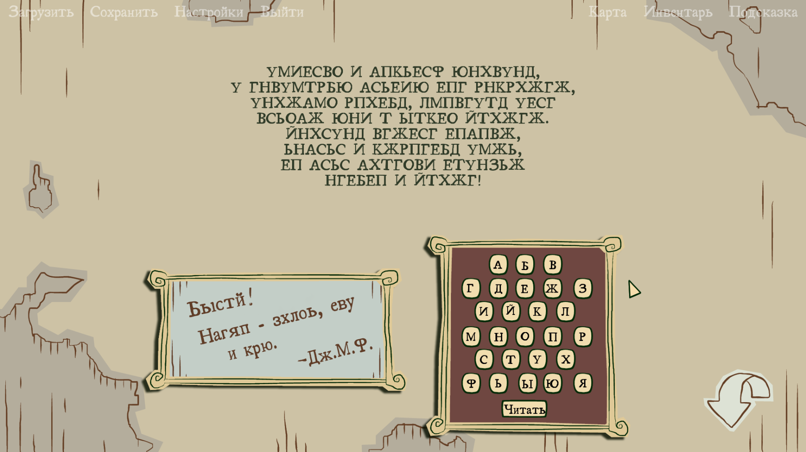

# Nelly Cootalot HD fixes

This folder contains script fixes for "Nelly Cootalot HD".

Tested on version ??? (Steam). Version number taken from ???.

> [!NOTE]
> I'm not sure which version I patched, but it was using AGS 3.4.1.14.

> [!WARNING]
> This patch contains changes specific to Russian language.

Timestamp: 2021-11-09 (yyyy-mm-dd).

This patch was made as a part of Russian translation by **Prometheus Project**.

[Prometheus Project](https://vk.com/prometheus_project) | 
[Download translation](https://disk.yandex.ru/d/jVEFhST2FGIyHQ)

## Issues

This game has several issues with translations:

- [x] Missing translation of game title.
- [x] Missing language choice in settings menu
- [x] Missing translation for "Bjorn N Olafssen" shop.
- [x] Untranslatable pirate cipher puzzle.
- [x] Missing subtitles for intro and outro videos.

Also fixed some existing bugs:

- [x] Spanish, German and Polish translations of "The End!" overlaps with other ending images (basically non-English versions never saw anything except "The End!" on their screens).
- [x] Hidden translation for some shops (they were translated but translation is never shown).
- [x] Misplaced shop title.

## Changes

> [!NOTE]
> Wow, I really went berserk on this one.

### Non-script changes

- acsprset.spr:
    - Added new sprites with Russian translation:
        - Added sprites 2207 and 2208 for game title (room0).
        - Added sprite 2212 for sign "closed" (room5).
        - Added sprite 2213 for sign "Bjorn N Olafssen" (room5).
        - Added sprite 2214 for sign "Sol island" (room12).
        - Added sprite 2232 for text "..on-hook" (room8).
        - Added sprites 2233 and 2234 for tattos (room16).
        - Added sprite 2235 for pirate cipher (when looking at inventory item).
        - Added sprite 2236 for pirate cipher (on puzzle screen).
    - Repacked with compression (reduced size by ~1gb).

- game28.dta:
    - Increased fonts count from 7 to 10 to support Russian fonts.
    - Set flags `SPF_640x400` (for proper scalling) and `SPF_ALPHACHANNEL` (for alpha-channel support) for sprites from 2208 to 30000.
    - Added new view 100 with two new animations for "Death!" flag in Russian.

- room0.crm:
    - Added new objects `oTitle` and `oSubtitle` to allow translation of game name in main menu.

- room5.crm:
    - Added new object `oBjornNOlafssen` to allow translation of "Bjorn N Olafssen" shop.
    - Added flag `OBJF_NOWALKBEHINDS` for `oSp4` so that it won't be hidden by a walk-behind (bugfix).

- room8.crm:
    - Changed `oSp1` object position (bugfix for HD version).

- room18.crm:
    - Changed `oSpanishEnd`, `oGermanEnd` and `oPolishEnd` objects baseline by 2 so that "The End" sprite correctly shows at the end (bugfix for Spanish, German and Polish languages).

### Script changes

- GlobalScript.scom3:
    - Changed `game_start` function:
        - Added support for standalone `Nelly_Russian.tra` for language setup at game start.
    - Changed `ChangeLanguage_Click`:
        - Added support for standalone `Nelly_Russian.tra` for language change in settings menu.
    - Added new function `setLanguageFont`:
        - Added font change support for "Load" and "Save" window titles.
        - Added font change support for 26 letter buttons on pirate oath screen.
        - Added font change support for `Label8` ("enter serial number" label) (why?).
    - Added new functions `setRussianFont`, `setItemTranslation` and `setSignedPostcardTranslation`.
    - Changed `setPolishFont` and `setNotPolishFont` functions.
    - Added call to `setItemTranslation` into `ChangeLanguage_Click` function.
    - Added call to `CallRoomScript(244)` into `ChangeLanguage_Click` function to support dynamic language change in rooms.
    - Changed `inventory13_a` and `inventory13_b` functions:
        - Added `Nelly_Russian.tra` support for pirate cipher item.
    - Changed `character21_b`:
        - Added `Nelly_Russian.tra` support for "Death!" flag.
    - Changed `inventory27_a` and `inventory27_b`:
        - Added `Nelly_Russian.tra` support for pink flag, rainbow and clover items.
    - Added call to `setSignedPostcardTranslation` into `inventory16_b` function:
        - Added `Nelly_Russian.tra` support for signed postcard item.
    Changed `New_Click` function:
        - Added `Nelly_Russian.tra` support for Russian subtitled intro video (Intro-frame-russian.ogv).

- room0.scom3:
    - Added new function `setTitleTranslation`.
    - Added call to `setTitleTranslation` into `room_AfterFadeIn` and `on_call`.

- room2.scom3:
    - Added new function `setObjectTranslation`:
        - Changed bar title translation logic.
        - Added support for Russian language.
    - Added new function `on_call`.
    - Added call to `setObjectTranslation` into `room_a` and `on_call`.

- room5.scom3:
    - Added new function `setObjectTranslation`:
        - Changed shop titles translation logic.
        - Added support for Russian language.
    - Added new function `on_call`.
    - Added call to `setObjectTranslation` into `room_a` and `on_call`.

- room7.scom3:
    - Added new function `setObjectTranslation`:
        - Changed book title translation logic.
        - Added support for Russian language.
    - Added new function `on_call`.
    - Added call to `setObjectTranslation` into `room_c` and `on_call`.

- room8.scom3:
    - Added new function `setObjectTranslation`:
        - Changed "hook-a-duck" title translation logic.
        - Added support for Russian language.
    - Added new function `on_call`.
    - Added call to `setObjectTranslation` into `room_b` and `on_call`.

- room12.scom3:
    - Added new function `setObjectTranslation`:
        - Changed island title translation logic.
        - Added support for Russian language.
    - Added new function `on_call`.
    - Added call to `setObjectTranslation` into `room_c` and `on_call`.

- room13.scom3:
    - Added new function `setObjectTranslation`:
        - Changed sign and flag translation logic.
        - Added support for Russian language.
    - Added new function `on_call`.
    - Added call to `setObjectTranslation` into `room_b` and `on_call`.

- room14.scom3:
    - Added new function `setObjectTranslation`:
        - Changed sign translation logic.
        - Added support for Russian language.
    - Added new function `on_call`.
    - Added call to `setObjectTranslation` into `room_b` and `on_call`.

- room16.scom3:
    - Added new function `setObjectTranslation`:
        - Changed tattoo translation logic.
        - Added support for Russian language.
    - Added new function `on_call`.
    - Added call to `setObjectTranslation` into `room_a` and `on_call`.

- room17.scom3:
    - Changed function `room_a`:
        - Added support for 26 Russian alphabet letters used for pirate cipher puzzle ("АБВГДЕЖЗИЙКЛМНОПРСТУХФЬЫЮЯ").
        - Added cipher text for Russian language.
        - Added new hint sprite for Russian language.

- room18.scom3:
    - Changed function `room_a`:
        - Added new "The End" sprite for Russian language.
        - Changed hard-coded credits font from `agsfnt3.ttf` to `Game.NormalFont` (bugfix).
        - Added Russian translation authors into end credits.

- room21.scom3:
    - Changed function `room_AfterFadeIn`:
        - Added `Nelly_Russian.tra` support for Russian subtitled outro video (Outro-frame-russian.ogv).

## Screenshots

Pirate cipher puzzle (unsolved):

> [!NOTE]
> Looking back I think I could've done a better job with cipher puzzle.
> Hint text is just nonsensical, could've used some clever Russian pangram.

Pirate cipher puzzle (solved):

