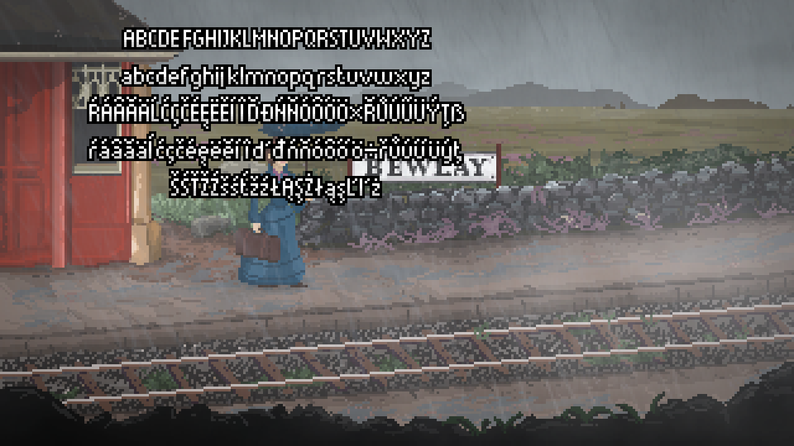
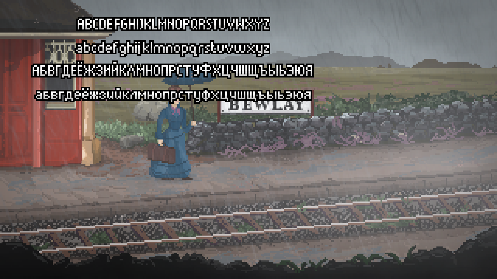
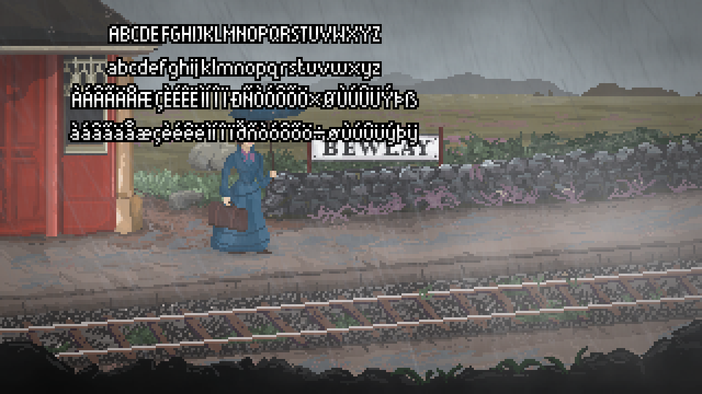

# The Excavation at Hob's Barrow fixes

This folder contains script fixes for "The Excavation at Hob's Barrow".

Tested on version 1.05 (GOG and Steam). Version number taken from main menu.

> [!NOTE]
> This patch supports multiple languages.

## Issues

This game has several issues with translations:

- [x] Bitmap font with only ASCII characters support.
- [x] Text with "typewriter" effect is not translated during animation.
- [x] Character names not translated in "show hotspots" overlay.

## Changes

- (added) encoding.txt:
    - Added `translation:encoding` pairs

- (added) encodings/windows-1250.txt:
    - Added symbol mappings for `windows-1250` encoding

- (added) encodings/windows-1251.txt:
    - Added symbol mappings for `windows-1251` encoding (partial)

- (added) encodings/windows-1252.txt:
    - Added symbol mappings for `windows-1252` encoding

### Non-script changes

- acsprset.spr:
    - Added new font sprite for translations ([spr18344](./bin/spr18344.png))

- sprindex.dat:
    - Updated to match new acsprset.spr

- game28.dta:
    - Changed font `9` line height to `11`
    - Changed fonts `13` and `14` line height to `AUTO` (set to font height)
    - Inserted new font sprite flags ([spr18344](./bin/spr18344.png))

### Script changes

- GlobalScript.scom3:
    - Added new global variable `Mapping*[] mappings` and `int newfont`
    - Added new `IsWhitespace`, `Trim`, `ParseEncodingsFile`, `ReadCharMapping` and `SetupVariableFont` functions
    - Changed `game_start`, `repeatedly_execute`, `turnoffcommentary` and `bSubs_OnClick` functions

- Typer.scom3:
    - Added call to `GetTranslation` for `CommentNARRATOR` function.

- ImportantItems.scom3:
    - Added call to `GetTranslation` for `AddSpot` function.

## Notes

This patch is using its own sprite font file for translations ([spr18344](./bin/spr18344.png)) when mapping is applied.\
You can make your own font bitmap and provide mappings for it by using `encoding.txt` and `encodings\<encoding_name>.txt` files.

On `game_start` we check if translation is used. If so, parse `encoding.txt` file and then read symbol mappings from an appropriate encoding file from `encodings` folder. If no translation is used or parsing\reading failed then execute original code.

> [!NOTE]
> Feel free to modify font bitmap. I'm sure I drew some symbols incorrectly.

### Font line height

Original font bitmap has `symbol height` of `12` and `line height` of `10` (or `11` in case of font 13). I've increased `symbol height` to `13` so that diacritical symbols (i.e. acute `´`, tilde `~`, breve `˘` etc.) would have enough space above letter as well as below (3 pixels for both). There's also a gap of 4 pixels between each 13 height lines so you could use this extra space for some symbols that require more pixels to be drawn in case you need it (beware of baseline though).

With that said, the default `line height` is now not enough for text to not overlap if diacritics are used, so I've also changed it to `AUTO` for fonts `13` and `14`. This solves problem of overlapping text, but introduces extra gap between lines which looks weird if diacritics are not used, so you might want to tweak this value for your translation (e.g. for Russian you should go with either `10` or `11`).\
Font 9 is used for some GUI text which has hardcoded position (like reading letter at very beginning), so increasing `line height` results in text overlap between different labels. Because of this I couldn't set it to anything higher then `11` without repositioning GUI labels (which would be unique to each translation).

You can change font `line height` in `game28.dta` if you need to have less space between the lines (see [game28.diff](./game28.diff)).

### Non sprite fonts

Some texts are using non sprite fonts like `ttf` or `wfn` (e.g. version text in main menu and chapter name). For those you would proceed as normal and replace letters at *extended* ASCII positions according to sprite font.

## How to use

### Patch installation

1. Add new sprite [spr18344.png](./bin/spr18344.png) into `acsprset.spr` and generate proper `sprindex.dat`.
    > [!NOTE]
    > If you're using AGSUnpacker for this then don't forget to increment last 32-bit integer in `header.bin` file.
2. Inject `*.scom3` scripts from [bin/GOG](./bin/GOG) or [bin/Steam](./bin/Steam) folder (depending on your version) into `game28.dta` using [AGSUnpacker](https://github.com/adm244/AGSUnpacker), [agsutils](https://github.com/rofl0r/agsutils) or manually.
3. Apply [game28.diff](./game28.diff) patch to `game28.dta` manually (using any hexeditor).
    > [!NOTE]
    > While diff file is using [haxdiff](https://github.com/rofl0r/haxdiff) format, haxdiff itself (its reference implementation) cannot be used to patch file properly (it truncates it at last insert hunk).
4. Copy [encoding.txt](./bin/encoding.txt) file and [encodings](./bin/encodings/) folder into root game folder (where `*.exe` is located).

> [!NOTE]
> Don't forget to place modified `game28.dta` into root game folder.

> [!NOTE]
> Patched `game28.dta` will work on both GOG and Steam version.

### Patch usage

1. Create your `*.tra` file.
2. Insert filename of your `*.tra` file into `encoding.txt` and specify encoding filename in `encodings` folder your translation should use.
3. Change `acsetup.cfg` so game would load your `*.tra` file:
```ini
[language]
translation=<tra_filename>
```

> [!NOTE]
> If changing `acsetup.cfg` located in root game folder doesn't have any effect then modify `acsetup.cfg` located at `%USERPROFILE%\Saved Games\<game_name>`.

> [!WARNING]
> Any save files made before this patch will result in game crashing since global data in `GlobalScript` has changed.

You can modify [spr18344.png](./bin/spr18344.png) as you wish and provide different mappings.

> [!WARNING]
> You can only map  up to 255 symbols.

## Screenshots

Translation file using `windows-1250` encoding:



Translation file using `windows-1251` encoding:



> [!WARNING]
> Windows-1251 encoding mapping contains only Russian alphabet symbols. If you need others you would have to add them yourself.

Translation file using `windows-1252` encoding:



> [!NOTE]
> Font line height is set in `game28.dta` and can be changed.\
> I've set it to 0 (AUTO) for fonts 13 and 14 for these screenshots so that text won't overlap.

